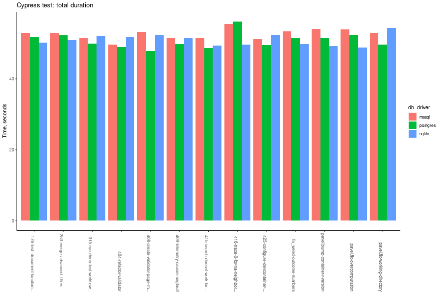
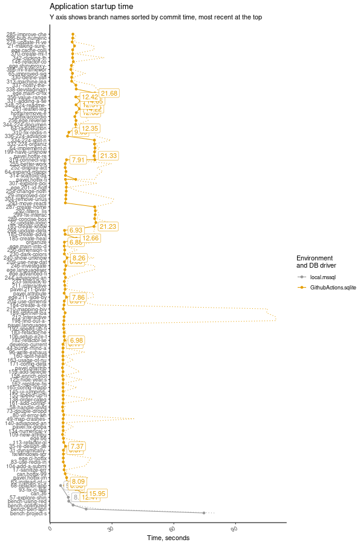

# Population Health Explorer by Boston Medical Center

## About the project

Lorem ipsum dolor sit...

## Requirements

- PowerShell (on Windows)
- Docker Desktop (Recommended version: [4.27.2](https://docs.docker.com/desktop/release-notes/#4272))
- Git (optional)

## Quick start

- [Quick start for RStudio users](docs/tutorials/quick_start_rstudio.md)

## Deployment

- [Deployment on Linux](docs/tutorials/deployment_linux.md)
- [Deployment on Windows](docs/tutorials/deployment_windows.md)

## Data and Environment Variables

- [Environment variables](docs/tutorials/env_variables.md)
- [Database Connection](docs/tutorials/data.md)
- [Cache](docs/tutorials/cache.md)
- [Authentication](docs/tutorials/authentication.md)

## Development

- [Application development: code modifications](docs/tutorials/development.md)
- [Quality Assurance & Testing](docs/tutorials/testing.md)
- [Release process](docs/tutorials/release.md)

## Complex features

- [Nested Accordion (UI)](docs/features/nested_accordion.md)
- [Advanced Analytics Framework](docs/features/advanced_analytics_framework.md)

## Troubleshooting

- [Frequently asked questions (FAQ)](docs/tutorials/faq.md)

## Benchmarks

### Cypress

Cypress end-to-end testing collects duration data - the time it takes to finish a test suite.
Aggregated data is presented in this readme, however more detailed data is available.

### Shiny.benchmark

> [!NOTE]
> As of 2024-06-19, this data is no longer collected due to stabilized startup performance.

Application startup time is measured on every feature branch during the CI pipeline run with the test data loaded into SQLite in-memory database.

