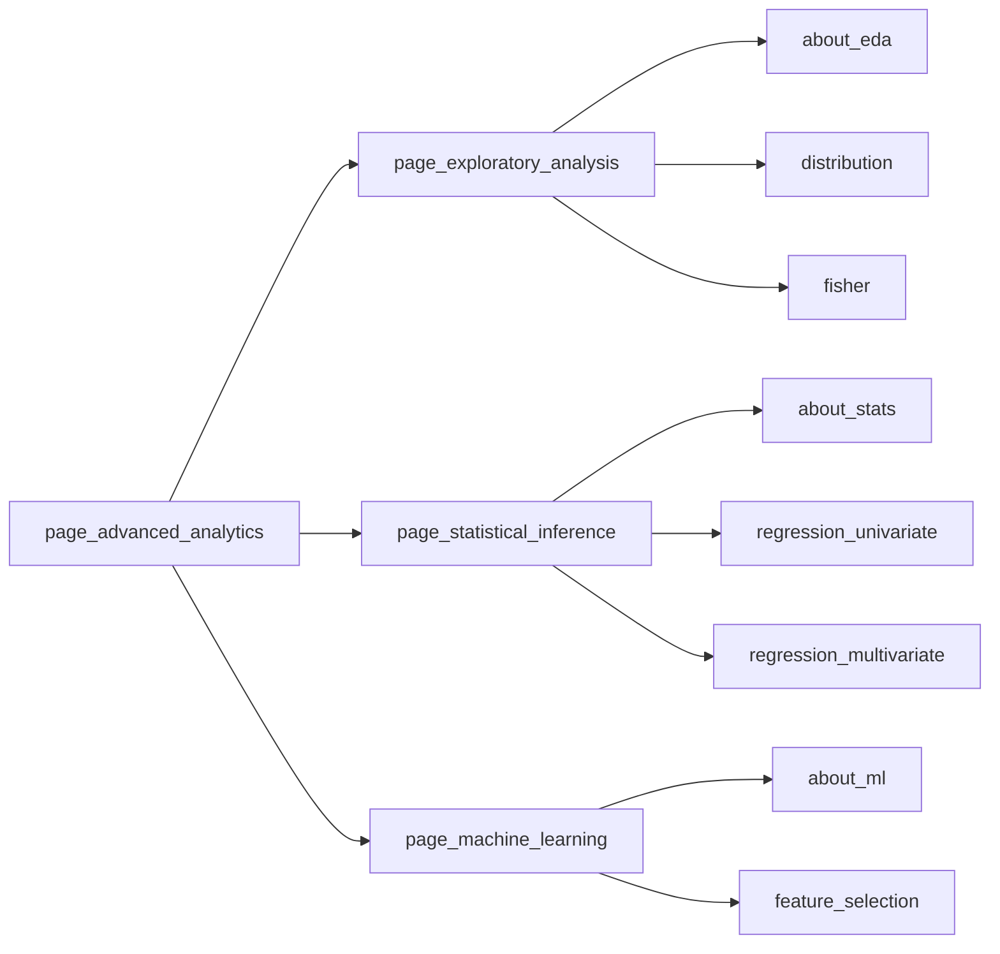

[Back to main README](../../README.md#complex-features)

# Advanced Analytics Framework

We call it a "framework" because it is a foundation that allows to easily extend Advanced Analytics
capabilities by developing and adding new modules.

## Structure

The Framework is comprised of three sections: Exploratory Data Analysis, Statistical Inference and Machine Learning.

Each section contains an arbitrary number of modules as well as a special `about` module that contains a brief description of the section.

Currently the structure of the Framework looks the following way:



## Which modules are available to the user

### Module inclusion

We can control which modules user can select using the `config.yml`.
If we set section value to `null` than all exported modules will be available.
However, we can explicitly list modules that we want to be rendered.
Note that `about` module must be included to appear in the app.

Example:

```yml
advanced_analytics_modules:
  exploratory_analysis: null
  statistical_inference: null
  machine_learning: ['feature_selection']
```

### Module order

By default, modules presented in the dropdown are sorted in the alphabetical order.
For example, in Statistical Inference page we have `regression_multivariate` and `regression_univariate` modules.
Alphabetically multivariate goes first, but we want to hint our users to explore the univariate option first.
We can **override the order** of modules with an explicit list in the config:

```yml
advanced_analytics_modules:
  exploratory_analysis: null
  statistical_inference: ['about', 'regression_univariate', 'regression_multivariate']
  machine_learning: null
```

### Module documentation

When creating new modules, we encourage developers to write inline documentation (comments, docstrings, etc).
But it is also essential to give users some information about the module.
There is a special `about` module that may contain general information about the page, but also about the modules.
It is possible to write a small markdown file for the new module, and then render it's content in the `about` module.
Please refer to [machine learning](../../applications/main/app/view/pages/page_advanced_analytics/machine_learning/modules/about.R) module for an example.

## How the framework works

Root view of the Framwork is `page_advanced_analytics.R`. It is just a Shiny module that calls each of its sections, which are Shiny modules as well.

Section modules are more interesting. If you look at `page_exploratory_analysis.R` file, you will see that its UI and server functions are created using a special `module_factory$factory()` function.

This factory takes in all the modules that the section has, and dynamically generates UI and server for each section based on the dropdown selection. This system works thanks to [box]() system of imports and exports.

You can check implementation of a particular module, say `distribution.R`. It has three exported objects: `LABEL`, `ui`, and `server`. Label controls how the module is called in the dropdown.

## What data is available to the module

### Server function arguments

Continue reading the `distribution.R` module. Please pay attention to the arguments that the `distribution$server()` takes:

- `equity_data_filtered` - this is a left join product of _demo_attributes_ and _equity_dimensions_ tables which is then filtered based on the filter criteria set by the user in global and advanced filters.
- `measure` - this is the selected equity dimension
- `cache_key` - this is a reactive objects with some common values that dictate when a shiny output cache should be used.

In case you need to change what objects are passed down to modules,
you need to update arguments of `page_advanced_analytics$server()` and arguments of all sections.
Note that you can use `...` argument which allows you to pass arbitrary number of arguments (this is how Factory is implemented), but it is not recommended - it is better to clearly see what objects are passed and available to the modules.

### Globally available data

Data that is passed through the arguments is only helpful to get the current context of how data is filtered and what is the target variable.

As a developer you have access to the overall data of the app through the `data_loader` class. We'll see how to use in the example below.

You also have access to values stored in the `session$userData` object - global filters, advanced filters, advanced settings, etc.

## How to create a new module

Process of creating a new analytics module is the same as creating any other Shiny module with few exceptions:

- module should export `LABEL` variable for a human-readable entry in the dropdown
- module should be exported in the corresponding `__init__.R` file (in the sam modules folder).

Let us consider an example of `feature_importance` module that we want to develop and add to the app.
We need to take the following steps:

#### New file

Create a new file in _app/view/pages/page_advanced_analytics/machine_learning/modules_ called `feature_importance.R`

#### Boilerplate code

Add boilerplate code  - I will copy it from _app/view/pages/page_advanced_analytics/exploratory_analysis/modules/fisher.R`_

#### Change label

Remember, value of the `LABEL` variable controls what the user will see in the dropdown. I will change it the following way:

```R
#' @export
VALUE <- "Feature Importance"
```

#### Change the UI

I think that in this module user will be interested in some visualization that shows top-10 important features in our data. We only need a plot output:

> [!NOTE]
> Do not forget to "box::use" functions that you use from other packages.
> In this case, I added `plotOutput` to the list of functions used from `shiny`.

```R
#' @export
ui <- function(id) {
  ns <- NS(id)

  box(
    width = 12,
    collapsible = FALSE,
    plotOutput(ns('feature_importance'))
  )
}
```

#### Change the Server

> [!NOTE]
> I am assuming, that I already have `get_feature_importance(target, data)` and `plot_feature_importance(importance_output)` functions defined in _app/logic/feature_importance.R_.
> For the sake of this example it is not important how these functions are implemented.

We have our target variable available to us from the `measure` parameter, but we don't have the data. To get the data:

1. We need to know whether we shuold work with ZIP or FIPS data
2. Import `data_loader` and get the full data from it (lazy table)
3. In this particular use-case we don't care about current filters, because we want to know what features are generally most imporant
4. However we need to sample the full data, otherwise we may not be able to load the complete dataset into memory.

First problem we will solve by accessing `session$userData` objsect - this is a special state storage in Shiny that is available from all modules within the app.

```R
place_attribute_type <- session$userData$advanced_settings_state$place_attribute_type
```

Next, we need to get the full data:

```R
box::use(app/logic/DataLoader[data_loader])

full_data <- if (place_attribute_type == "FIPS") {
  data_loader$tbl_list$fips_data
} else {
  data_loader$tbl_list$zip5_data
}
```

Now let's sample it:

```R
sampled_data <- slice_sample(full_data, n = 5000)
```

And finally we can use `sampled_data` as an argument to our `get_feature_importance()` function and plot it. This is how the entire server looks like:

```R
#' @export
server <- function(id, equity_data_filtered, measure, cache_key) {
  moduleServer(id, function(input, output, session) {
    output$feature_importance <- renderPlot({
      place_attribute_type <- session$userData$advanced_settings_state$place_attribute_type

      full_data <- if (place_attribute_type == "FIPS") {
        data_loader$tbl_list$fips_data
      } else {
        data_loader$tbl_list$zip5_data
      }

      sampled_data <- slice_sample(full_data, n = 5000)

      importance_output <- get_feature_importance(measure(), sampled_data)

      plot_feature_importance(importance_output)
    })
  })
}
```

Please note that even though we didn't use `equity_data_filtered`, we must not delete it from the server arguments.
