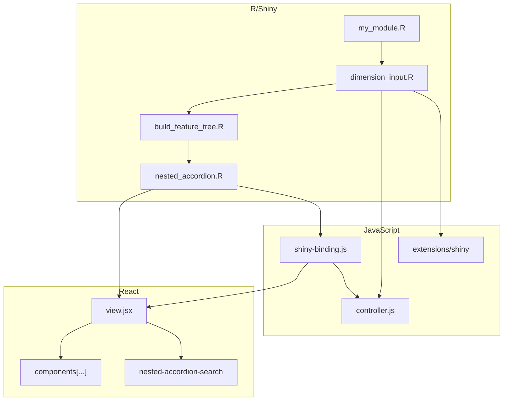

[Back to main README](../../README.md#complex-features)

# Nested Accordion

Nested accordion is a completely custom feature that is supposed to be a sophisticated replacement for a select input. In terms of UI, it is presented inside a modal and it is called "nested accordion" because it is an accordion where each sub-section may be another accordion.

The core idea of this component is a recursive tree-like data structure that looks like `category -> category -> variable` with arbitrary sequence of categories. Component recursively goes over categories to render accordion sections, and when it gets to "variable" level, it renders user inputs.

Use cases for this component include:
- Single selection of a variable. This is how user currently selects an equity dimension (sometimes called `measure` in the code). On the "variable" or "user input" level user will see buttons - clicking a button will select a variable.
- Single selection of a variable category. This is how user currently selects a numerical variable for a univariate regression. On the "variable" level user will see a select picker with choices. When a choice is selected variable + category will be selected.
- Multiple selection. This is how user currently selects dimension attributes (how to stratify the runchart).
- Multiple selection (advanced filters). This looks and works similar to multiple selection, but the inputs are not controlled by React and there is no usage of React.Context to ensure minimal re-renders.

A brief history of this component goes as follows:
- The component was initially created in R using a recursive function based on `bs4Dash::accordion()`.
- However its performance was very poor due to Shiny trying to bind 500+ inputs when it rendered them. It was replaced with a React component (made available in Shiny thanks to `Rhino` + `shiny.react`) that basically reproduced the same HTML structure without Shiny binding.
- Some time later, `ReactBootstrap` was brought into the game to make sure that we avoid rewriting existing code.
- Finally, due to the differences in React state management and "old way" of state management, the user experience was sometimes unintuitive. So we ditched the `ReactBootstrap.Accordion` in favor of good old `ul` + `li` combination.

To understand the technical side better, here is a simplified diagram that shows which files are involved to facilitate a Nested Accordion - should help to know where to look for problems and where to make changes.

Explanation of the diagram:

1. You want to add the component to your module (it can also be an existing shiny module). To do so, you need to add `dimension_input$ui()` and `dimension_input$server()` to the ui and server parts respectively in the ***my_module***. Please read the code in ***dimension_input.R*** to learn more about the parameters.
2. Next, ***dimension_input*** module creates a button and observes a click on that button. When a button is clicked, it opens a modal and calls  ***nested_accordion***. Apart from calling ***nested_accordion*** this module also contains server-side logic that processes values received from the client, and sends them furhter to other R modules as a reactive value.
3. ***nested_accordion*** calls ***build_feature_tree*** to generate the tree-like data. It then serializes that data (converts to a JSON string), prepares a React component and sends it to the web browser where ***shiny-binding*** takes care of JS-Shiny communication, and ***view*** renders the UI of the component.
4. ***shiny-binding*** is powered by the ***controller*** - extracted logic that makes the component work: react to certain events from ***view***, process and send value back to ***dimension_input*** as well as receive custom messages from ***dimension_input*** (e.g. to reset component state).
5. Different pieces of Javascript code depend on some data that is being sent from R to the client though custom message handlers defined in ***extensions/shiny***
6. Finally, the ***view*** renders the NestedAccordion with the help of various react components defined in ***components/**** files.
