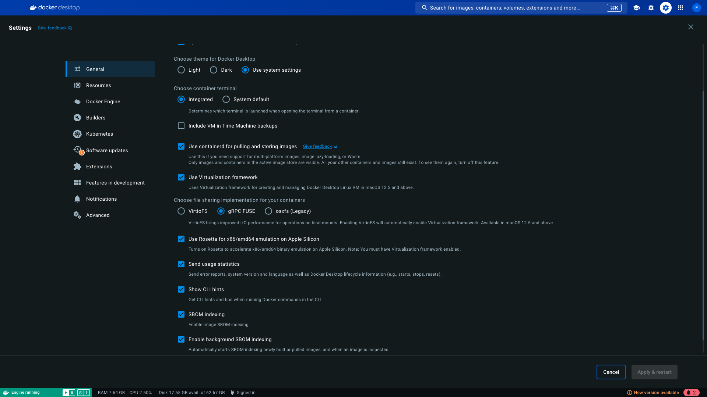

[Back to main README](../../README.md#development)

# Application Development

There are two ways to develop the application:

- By directly opening project in the IDE of choice.
See [Quick start with RStudio](./quick_start_rstudio.md) guide to learn more.
- By opening the project inside a Devcontainer.
This method is preferred to ensure pre-defined development environment with necessary system dependencies and tools.
However, running a devcontainer has a substantial resource overhead that results in a noticably performance penalty.
Only use it with a powerful machine.

## Docker Settings

This section is for those who use Apple Sillicon chips (M1, M2, M3, etc) or any other arm processors.

We build our docker images in the cloud, and to do that as efficiently as possible, we only build for amd64 platform.
Modern macs have arm64 platform, so make sure that your Docker Desktop settings support cross-platform virtualization.
Please refer to this screenshot and check that your settings are the same/similar.



## System dependencies

MacOS users often install their dependencies using `brew`, however we strongly recommend to install R from official CRAN distribution.

If you install `gcc`, `clang` and/or other build tools using brew, consider creating `~/.R/Makevars` file with the following content:

```Makefile
# # Homebrew bin / opt / lib / include locations
HB=/opt/homebrew/bin
HO=/opt/homebrew/opt
HL=/opt/homebrew/lib
HI=/opt/homebrew/include

# MacOS Xcode header location
# (do "xcrun -show-sdk-path" in terminal to get path)
XH=/Library/Developer/CommandLineTools/SDKs/MacOSX.sdk

# # # ccache
CCACHE=$(HB)/ccache

# Make using all cores (set # to # of cores on your machine)
MAKE=make -j8

# LLVM (Clang) compiler options
CC=$(CCACHE) $(HO)/llvm/bin/clang
CXX=$(CC)++
CXX98=$(CC)++
CXX11=$(CC)++
CXX14=$(CC)++
CXX17=$(CC)++

# FORTRAN
FC=$(CCACHE) $(HB)/gfortran
F77=$(FC)
FLIBS=-L$(HL)/gcc

# STD libraries
CXX1XSTD=-std=c++0x
CXX11STD=-std=c++11
CXX14STD=-std=c++14
CXX17STD=-std=c++17

# FLAGS
STD_FLAGS=-g -O3 -Wall -pedantic -mtune=native -pipe
CFLAGS=$(STD_FLAGS)
CXXFLAGS=$(STD_FLAGS)
CXX98FLAGS=$(STD_FLAGS)
CXX11FLAGS=$(STD_FLAGS)
CXX14FLAGS=$(STD_FLAGS)
CXX17FLAGS=$(STD_FLAGS)

# Preprocessor FLAGS
# NB: -isysroot refigures the include path to the Xcode SDK we set above
CPPFLAGS=-isysroot $(XH) -I$(HI) \
 -I$(HO)/llvm/include \
 -I$(HO)/openssl/include \
 -I$(HO)/gettext/include \
 -I$(HO)/tcl-tk/include

# Linker flags (suggested by homebrew)
# LDFLAGS+=-L$(HO)/llvm/lib -Wl,-rpath,$(HO)/llvm/lib

# Flags for OpenMP support that should allow packages that want to use
# OpenMP to do so (data.table), and other packages that bork with
# -fopenmp flag (stringi) to be left alone
SHLIB_OPENMP_CFLAGS=-fopenmp
SHLIB_OPENMP_CXXFLAGS=-fopenmp
SHLIB_OPENMP_CXX98FLAGS=-fopenmp
SHLIB_OPENMP_CXX11FLAGS=-fopenmp
SHLIB_OPENMP_CXX14FLAGS=-fopenmp
SHLIB_OPENMP_CXX17FLAGS=-fopenmp
SHLIB_OPENMP_FCFLAGS=-fopenmp
SHLIB_OPENMP_FFLAGS=-fopenmp
```

## R development

Main application is a [Rhino](https://appsilon.github.io/rhino/) shiny app.
It is strongly recommended to get familiar with the [official documentation](https://appsilon.github.io/rhino/) -
it covers most of the required knowledge to be able to contribute to the application code.

There are some non-trivial and complex solutions within the application, you can learn more in the [Complex features](../../README.md#complex-features) section.

## JavaScript Development

It is strongly recommended to use Visual Studio Code to write JavaScript in this project.

You can make use of `applications/main/.rhino/node_modules` folder in each application project to install 3rd party types and use them in your editor.

To install code suggestions for Shiny and Leaflet:

```shell
cd applications/main/.rhino
npm install -D https://github.com/rstudio/shiny # may take a few minutes
npm install -D @types/leaflet
```

To make use of the suggestions, in the edited JS file add a special reference comment, e.g.:
```javascript
/// <reference types="../../.rhino/node_modules/@types/leaflet/" />
```
